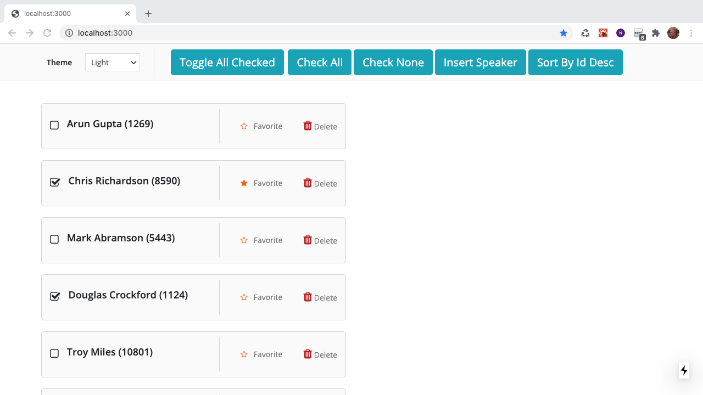

# Desperately Seeking Code Review 
Looking for help from an Apollo Client 3.0 expert, **I will donate $100 to a charity** of the choice.  All others are welcome.

# How to Help Specifically

I'd love to know more about using github's code review capabilities. I've never use that but if it's great, jump in and do it there.  Otherwise, whatever code review tool you want.  Most of you know my email address from being the organizer of [Silicon Valley Code Camp](https://www.siliconvalley-codecamp.com/About/#) for 15 years,  but if you don't reach out to me on my blog contact page at https://peterkellner.net .

I'm really wanting an Apollo Client 3.0 wizard to help with this so which ever wizard steps up first will be able to choose which charity I'll donate the $100 to.  Anyone else helps, I really appreciate it and all I can say is there are a lot worse ways you could spend your fun time.

## What I Want in Code Review

From a high level, this is the demo app for an online course I'm building that is intermediate and focus on Apollo Client 3.0 performance.  That means best optimization and usage of Cache and not using any obsolete technologies in Apollo like local resolvers.

What my primary motivation for needing help is that as you'll see when running the app, I have a "virtual" checkbox column for my speakers list that I've defined using a field policy on the Speaker type. I'm worried that I did not implement that correctly following best practices. Specifically, I had expected that I would create the field and somehow it would show up in the chrome extension cache viewer, then I'd modify the data more or less directly using the Cache api.  I did not do that at all but took a different approach using `makevar`.

### What I am looking for:

1. Review Code in `ApolloClient` folder and not `ApolloServer` folder
2. Best Practices recommendations I'm not following regarding AC 3.0
3. Embarrasing usage of JavaScript, React or Apollo

### What I'm not looking for in particular, but always open to suggestions

1. Not wanting feedback on css or html
2. Not particularly interested in React Code Feedback, but happy to get feedback
3. Not really interested in coding style feedback, bu happy get that feedback

Bonus (they just delivered in karma, no extra charitable donation)

Figure out why NextJS is spitting out html mismatch error (see issue I posted to NextJS forums [here]( https://github.com/vercel/next.js/issues/18114)

## How to Run Server and Client

### Apollo Server 

Execute `npm install` then `npm start`.  Sometimes, control c'ing thing  running server project does not quite the GraphQL server running on port 4000 or the json-server running on port 5000.  Bonus points for figuring out why.

### Apollo Client

Execute `npm install` then `npm run dev`. Browse to port 3000 for app.

This is the running app you should see for the Apollo Client.

